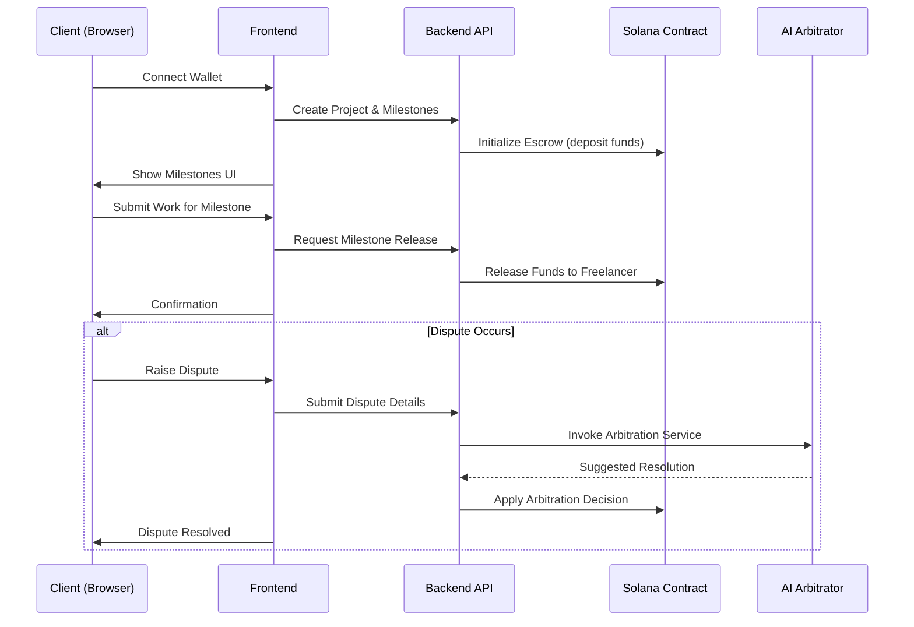

# Payshield
# Payshield

## Why This Project Was Created?

Payshield was built to address the **trust and transparency gaps** that exist in freelance marketplaces and decentralized escrow services. Traditional platforms rely on centralized intermediaries that can be costly, opaque, and prone to disputes. Payshield leverages **Solana blockchain smart contracts** and an **AI‑driven arbitrator** to create a **secure, low‑fee, and auditable** environment where clients and freelancers can collaborate with confidence.

## Who Is It For?

- **Freelancers** seeking guaranteed payment for their work.
- **Clients/Businesses** that want to hire talent without fearing non‑delivery.
- **Developers** interested in building on Solana, exploring AI‑assisted arbitration, or extending a modular escrow system.
- **Blockchain enthusiasts** looking for a real‑world use‑case of decentralized finance (DeFi) in the gig economy.

## What Problem Does It Solve?

1. **Payment Risk** – Eliminates the "pay‑up‑front, get‑nothing" problem.
2. **Dispute Resolution** – Provides an automated, AI‑augmented arbitration flow that reduces reliance on costly legal processes.
3. **Transparency** – All contract actions are recorded on‑chain, giving both parties immutable proof of agreement and execution.
4. **Low Transaction Fees** – By using Solana’s high‑throughput, low‑cost network, fees stay minimal compared to Ethereum or traditional escrow services.

---

## Features

- **Smart‑Contract Escrow** – Securely hold funds in a Solana program until milestones are approved.
- **AI Arbitrator** – Uses a lightweight AI model to suggest resolutions based on contract terms and prior disputes.
- **Milestone Management** – Create, update, and release funds for project milestones.
- **Realtime Notifications** – WebSocket‑based updates for contract state changes.
- **Full‑stack UI** – React‑based frontend with wallet integration (Phantom, Solflare).
- **Extensible Architecture** – Plug‑in points for additional dispute‑resolution modules, analytics, or third‑party services.

---

## Architecture Overview

```mermaid
flowchart TB
    subgraph Frontend[Frontend (React/Vite)]
        F1[UI Components]
        F2[Wallet Connection]
        F3[API Service Layer]
    end
    subgraph Backend[Backend (Node.js/Express)]
        B1[REST API]
        B2[AI Arbitration Service]
        B3[Database (PostgreSQL)]
    end
    subgraph Solana[Solana Smart Contracts]
        S1[Escrow Program]
        S2[DisputeArbitrator Program]
    end
    subgraph Infra[Infrastructure]
        I1[GitHub CI/CD]
        I2[Docker/K8s (optional)]
    end
    %% Relationships
    F1 --> F2 --> F3 --> B1
    B1 --> B2
    B1 --> B3
    B2 --> S2
    B1 --> S1
    S1 --> S2
    I1 -->|triggers| B1
    I1 -->|triggers| F1
```

### Component Breakdown

- **Frontend** – Handles user interaction, wallet onboarding, and displays contract state. Communicates with the backend via REST API.
- **Backend** – Orchestrates business logic, stores off‑chain metadata, and hosts the AI arbitration service.
- **Solana Programs** – On‑chain escrow and dispute contracts that enforce payment rules and allow arbitration outcomes to be enforced.
- **AI Arbitration Service** – Consumes contract metadata and past dispute outcomes to generate recommended resolutions.

---

## Sequence Diagram (Typical Flow)



---

## Dataflow Chart

```mermaid
graph LR
    subgraph User Interaction
        U1[User (Client)] -->|Creates Project| UI[Web UI]
        U2[User (Freelancer)] -->|Accepts Project| UI
    end
    UI -->|REST Calls| BE[Backend Service]
    BE -->|Store Metadata| DB[(PostgreSQL)]
    BE -->|Invoke| AI[AI Arbitration Service]
    BE -->|Submit Tx| SOL[Solana Network]
    SOL -->|Emit Events| UI
    AI -->|Return Decision| BE
    DB -->|Audit Logs| UI
```

---

## Getting Started

### Prerequisites

- **Node.js** (>= 18)
- **Yarn** or **npm**
- **Rust & Cargo** (for Solana program compilation)
- **Solana CLI** (`solana --version` >= 1.16)
- **Phantom** or **Solflare** wallet extension
- **Git**

### Clone the Repository

```bash
# Clone the repo
git clone https://github.com/AkshataUbhale/Payshield.git

# Change into the project directory
cd Payshield
```

### Install Frontend Dependencies

```bash
# Frontend (React/Vite)
cd frontend
npm install   # or `yarn install`
```

### Install AI‑Arbitrator Frontend (optional demo)

```bash
cd ../features/ai-arbitrator/frontend
npm install   # or `yarn install`
```

### Set Up the Solana Programs

```bash
# Install Solana toolchain (if not already installed)
sh -c "$(curl -sSfL https://release.solana.com/v1.16/install)"

# Build the on‑chain programs
cd ../../contracts/programs/solanahub_protocol
cargo build-bpf   # compiles to BPF for deployment
```

### Deploy to Localnet (for development)

```bash
# Start a local Solana validator
solana-test-validator &

# Deploy the escrow program
solana program deploy target/deploy/solanahub_protocol.so
```

### Run the Backend (API + AI Service)

```bash
cd ../../backend
npm install   # install server deps
npm run dev   # starts API on http://localhost:3000
```

### Run the Frontend

```bash
cd ../../frontend
npm run dev   # Vite dev server at http://localhost:5173
```

### Open the App

1. Open your browser at `http://localhost:5173`.
2. Connect your Solana wallet.
3. Create a project, fund the escrow, and start working!

---

## Contributing

1. Fork the repository.
2. Create a feature branch (`git checkout -b feature/awesome‑feature`).
3. Ensure code passes linting and unit tests.
4. Open a Pull Request describing the change.

Please follow the **Code of Conduct** and write clear commit messages.

---

## License

This project is licensed under the **MIT License** – see the `LICENSE` file for details.

---

## Contact & Support

- **Maintainer**: Akshata Ubhale – [GitHub](https://github.com/AkshataUbhale)
- **Issues**: Open a ticket on the repository's *Issues* tab.
- **Discord**: Join the community channel (link in repo README) for real‑time help.

---

*Happy building with Payshield – where trust meets technology!*

