# Payshield: A Decentralized Freelance Marketplace on Solana — Algorithm Design, Complexity Analysis, and Pseudocode

**Authors:** Akshata Ubhale et al.
**Affiliation:** Department of Computer Science and Engineering
**Conference/Journal:** IEEE International Conference on Blockchain and Distributed Systems
**Date:** July 2026

---

## Abstract

Payshield is a trustless, decentralized freelance marketplace built on the Solana blockchain. It leverages a combination of cryptographic authentication, heuristic artificial intelligence recommendation engines, rule-based natural language processing for dispute resolution, and smart contract-enforced financial primitives to eliminate intermediary dependency in the global freelance economy. This paper presents a rigorous technical investigation of thirteen core algorithms embedded across the system's backend (Node.js/TypeScript), on-chain smart contract layer (Rust/Anchor Framework), and client-side interface (React/Vite). For each algorithm, we provide a formal description of purpose and context, complete pseudocode, time and space complexity analysis using Big-O notation, and detailed flowcharts modeled after IEEE convention. The paper demonstrates that Payshield achieves a compelling balance of computational efficiency, cryptographic soundness, and economic fairness suitable for production deployment on a high-throughput blockchain.

**Index Terms** — Blockchain, Solana, Decentralized Escrow, Ed25519 Cryptography, AI Recommendation, Dispute Arbitration, Smart Contracts, Rust/Anchor, Freelance Marketplace, Token Staking.

---

## I. Introduction

The global freelance economy, valued at over USD 1.5 trillion, continues to suffer from systemic trust failures: unverified identities, disputed deliverables, delayed payments, and platform-imposed fee extractions. Centralized intermediaries such as Upwork and Fiverr mitigate some risks but introduce a single point of control, censorship risk, and opacity in dispute resolution.

Payshield addresses these structural deficiencies through a three-layered architecture:

1. **Smart Contract Layer** — A Rust-based Anchor program deployed on Solana implementing trustless escrow, milestone-based payment release, on-chain reputation scoring, and DAO-based dispute governance.
2. **Backend API Layer** — A TypeScript/Express server implementing wallet-based authentication, AI-driven job and freelancer recommendations, and AI-assisted dispute arbitration.
3. **Client Layer** — A React/Vite interface providing real-time skill matching, deadline tracking, and wallet-signed interaction.

This paper is organized as follows. Section II presents the system architecture. Sections III through XV detail each algorithm individually with pseudocode, complexity analysis, and flowcharts. Section XVI presents a comparative complexity summary, and Section XVII concludes with observations and future directions.

---

## II. System Architecture Overview

The Payshield system comprises three distinct computational layers that interact in a coordinated pipeline.

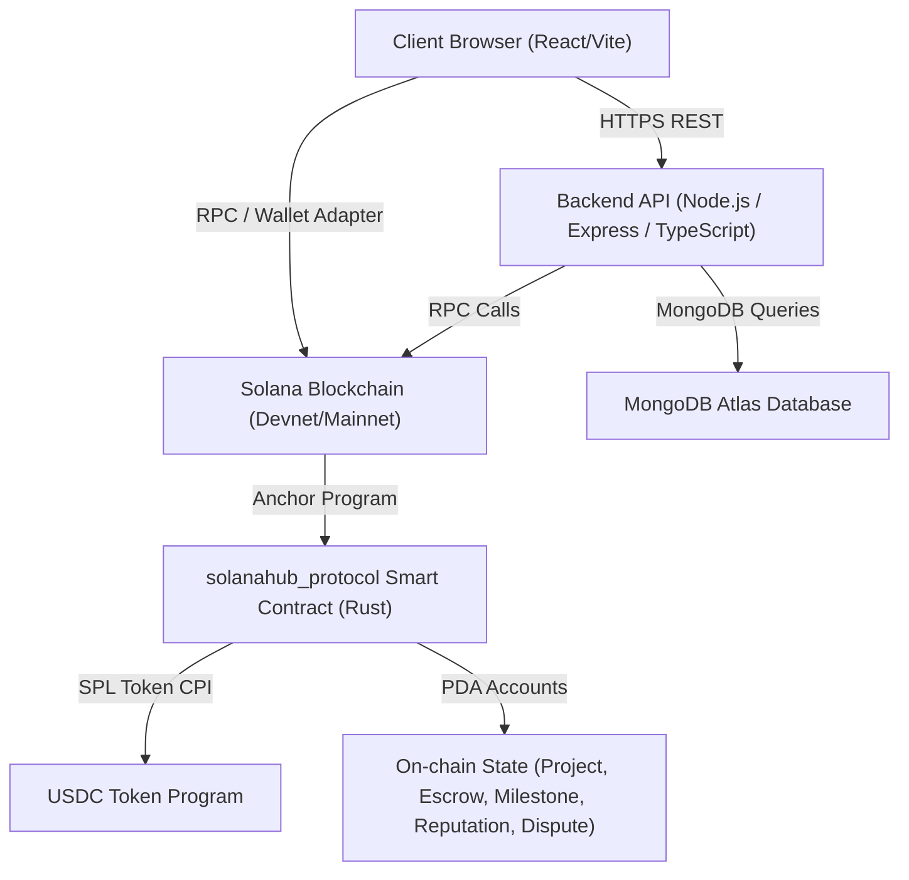

The smart contract, identified by program ID `43QYPVLRMQ9skLbbbZ3uGPsLtTbxcmuU4S5hoZ8bXJKS`, is the authoritative source of financial truth. The backend database (MongoDB) stores off-chain data (full text, UI state), while all financial state transitions are enforced exclusively on-chain.

---

## III. Algorithm 1: Wallet-Based Challenge-Response Authentication

### A. Purpose and Context

Traditional username-password authentication is incompatible with a decentralized identity model where users are identified solely by their public keys. Payshield implements a cryptographic challenge-response protocol using the Ed25519 digital signature scheme native to Solana wallets. The server issues a one-time nonce (number used once) that the client signs with their private key. The server verifies the signature using the corresponding public key. Upon successful verification, a JSON Web Token (JWT) is issued for subsequent API access. The nonce is rotated after each successful login to prevent replay attacks.

**Source Files:** [`authController.ts`](file:///Users/akshata/Desktop/Payshield/src/controllers/authController.ts), [`authMiddleware.ts`](file:///Users/akshata/Desktop/Payshield/src/middleware/authMiddleware.ts)

**Libraries:** `tweetnacl` (Ed25519), `bs58` (Base58 encoding), `crypto` (CSPRNG nonce), `jsonwebtoken`

### B. Pseudocode

```
ALGORITHM: GetNonce
INPUT:  publicKey (Base58 string)
OUTPUT: nonce (64-character hex string)

1.  nonce <- crypto.randomBytes(32).toString("hex")
2.  user  <- Database.findOne({ publicKey })
3.  IF user EXISTS THEN
4.      user.nonce <- nonce
5.  ELSE
6.      user <- new User({ publicKey, nonce })
7.  END IF
8.  Database.save(user)
9.  RETURN nonce


ALGORITHM: Login (Challenge-Response Verification)
INPUT:  publicKey (Base58), signature (Base58)
OUTPUT: JWT token OR error

1.  user <- Database.findOne({ publicKey })
2.  IF user IS NULL OR user.nonce IS NULL THEN
3.      RETURN ERROR 400 "Request nonce first"
4.  END IF
5.  nonceBytes   <- TextEncoder.encode(user.nonce)
6.  sigBytes     <- Base58.decode(signature)
7.  pubKeyBytes  <- Base58.decode(publicKey)
8.  verified     <- nacl.sign.detached.verify(nonceBytes, sigBytes, pubKeyBytes)
9.  IF NOT verified THEN
10.     RETURN ERROR 401 "Invalid signature"
11. END IF
12. payload <- { id: publicKey, role: user.role }
13. token   <- JWT.sign(payload, JWT_SECRET, { expiresIn: "24h" })
14. user.nonce <- crypto.randomBytes(32).toString("hex")  // rotate nonce
15. Database.save(user)
16. RETURN { token, user }


ALGORITHM: AuthMiddleware (JWT Verification)
INPUT:  HTTP Authorization header
OUTPUT: Decoded user object OR 401 error

1.  token   <- request.header("Authorization").replace("Bearer ", "")
2.  IF token IS NULL THEN RETURN ERROR 401 END IF
3.  decoded <- JWT.verify(token, JWT_SECRET)
4.  request.user <- decoded.user
5.  CALL next()
```

### C. Flowchart

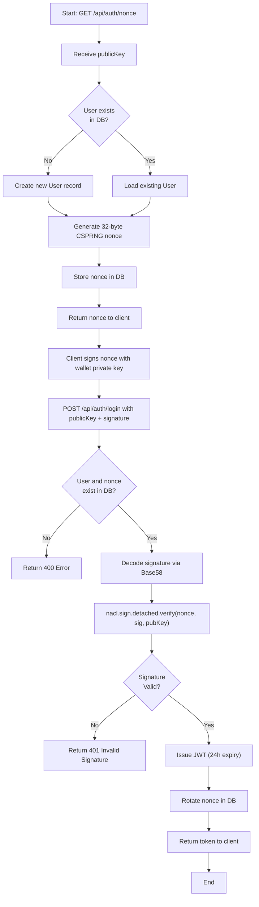

### D. Time and Space Complexity

| Operation | Time Complexity | Space Complexity |
|---|---|---|
| Nonce generation (`crypto.randomBytes`) | O(1) | O(1) — 32 bytes fixed |
| Database upsert | O(log n) — indexed by publicKey | O(1) per record |
| Base58 decode | O(k) — k = string length (~44 chars) | O(k) |
| Ed25519 verify (`nacl.sign.detached.verify`) | O(1) — fixed 64-byte signature, 32-byte key | O(1) |
| JWT sign/verify | O(1) — HMAC-SHA256 over fixed payload | O(p) — p = payload size |
| **Overall Login** | **O(log n)** dominated by DB lookup | **O(k)** |

Where n is the number of registered users. The Ed25519 verification is computationally O(1) with respect to data size since both the signature (64 bytes) and key (32 bytes) are fixed-length.

---

## IV. Algorithm 2: AI Job Recommendation Engine

### A. Purpose and Context

Open projects must be surfaced to the most relevant freelancers. Rather than relying on a full machine learning pipeline — which would introduce latency and infrastructure complexity — Payshield implements a deterministic, weighted multi-criteria scoring algorithm. Each open project is assigned a numeric match score in the range [0, 100] relative to the querying freelancer. Three dimensions are evaluated: skill overlap (60% weight), budget compatibility (20% weight), and category match (20% weight). Results are sorted in descending score order and returned as a ranked list.

**Source File:** [`aiController.ts`](file:///Users/akshata/Desktop/Payshield/src/controllers/aiController.ts) — `getRecommendedJobs()`

### B. Pseudocode

```
ALGORITHM: GetRecommendedJobs
INPUT:  freelancer (User object with skills[], hourlyRate)
OUTPUT: Sorted list of { project, matchScore, matchedSkills, category }

1.  openProjects <- Database.find({ status: "open" })
2.  recommendations <- []

3.  FOR EACH project IN openProjects DO
4.      projectText <- LOWERCASE(project.title + " " + project.description)

        // --- Criterion 1: Skill Overlap (weight = 0.60) ---
5.      matchedSkills <- []
6.      FOR EACH skill IN freelancer.skills DO
7.          IF LOWERCASE(skill) IN projectText THEN
8.              APPEND skill TO matchedSkills
9.          END IF
10.     END FOR
11.     IF freelancer.skills.length > 0 THEN
12.         skillScore <- ROUND((matchedSkills.length / MAX(1, freelancer.skills.length)) * 100)
13.     ELSE
14.         skillScore <- 0
15.     END IF

        // --- Criterion 2: Budget Match (weight = 0.20) ---
16.     expectedBudget <- freelancer.hourlyRate * 20   // assumes 20-hour effort
17.     IF project.budget < expectedBudget THEN
18.         budgetScore <- MAX(0, ROUND((project.budget / expectedBudget) * 100))
19.     ELSE
20.         budgetScore <- MAX(0, ROUND(100 - ((project.budget - expectedBudget) / expectedBudget) * 20))
21.     END IF

        // --- Criterion 3: Category Match (weight = 0.20) ---
22.     categories <- ["frontend","backend","full stack","blockchain","design","marketing"]
23.     categoryScore <- 50  // default neutral
24.     matchedCategory <- "General"
25.     FOR EACH cat IN categories DO
26.         IF cat IN projectText THEN
27.             matchedCategory <- CAPITALIZE(cat)
28.             IF ANY(skill IN freelancer.skills WHERE LOWERCASE(skill) CONTAINS cat) THEN
29.                 categoryScore <- 100
30.             END IF
31.             BREAK
32.         END IF
33.     END FOR

        // --- Weighted Total ---
34.     matchScore <- ROUND((skillScore * 0.6) + (budgetScore * 0.2) + (categoryScore * 0.2))
35.     APPEND { project, matchScore, matchedSkills, matchedCategory } TO recommendations

36. END FOR

37. SORT recommendations BY matchScore DESCENDING
38. RETURN recommendations
```

### C. Flowchart

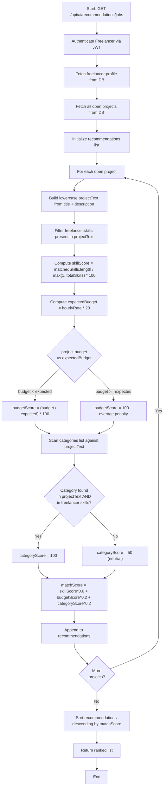

### D. Time and Space Complexity

Let P = number of open projects, S = number of freelancer skills, C = number of categories (constant = 6), L = average length of project description text.

| Operation | Time Complexity | Space Complexity |
|---|---|---|
| Database fetch all open projects | O(P) | O(P) |
| Skill scan per project | O(S * L) — substring search for each skill | O(S) |
| Budget computation | O(1) | O(1) |
| Category scan | O(C * L) — C is constant (6) = O(L) | O(1) |
| Sort recommendations | O(P log P) | O(P) |
| **Overall** | **O(P * (S + L) + P log P)** | **O(P + S)** |

The dominant term is O(P * S) when skill count is the primary variable. For typical use (P < 10,000, S < 50), execution is well within single-digit millisecond range.

---

## V. Algorithm 3: AI Freelancer Recommendation Engine

### A. Purpose and Context

The complementary recommendation problem: given a client's project, identify the most suitable freelancers. This algorithm evaluates three dimensions: skill overlap with the project description (50% weight), historical rating and completed jobs composite (30% weight), and hourly rate compatibility with project budget (20% weight). The higher weight on skills (50% vs 60% in Algorithm 2) reflects the client's priority, while history (30%) carries more weight than in the job-side algorithm where budget fit takes precedence.

**Source File:** [`aiController.ts`](file:///Users/akshata/Desktop/Payshield/src/controllers/aiController.ts) — `getRecommendedFreelancers()`

### B. Pseudocode

```
ALGORITHM: GetRecommendedFreelancers
INPUT:  projectId (string)
OUTPUT: Sorted list of { freelancer, matchScore, matchedSkills }

1.  project      <- Database.findOne({ projectId })
2.  IF project IS NULL THEN RETURN ERROR 404 END IF
3.  freelancers  <- Database.find({ role: "freelancer" })
4.  projectText  <- LOWERCASE(project.title + " " + project.description)
5.  recommendations <- []

6.  FOR EACH freelancer IN freelancers DO
7.      skills <- freelancer.skills OR []

        // --- Criterion 1: Skill Overlap (weight = 0.50) ---
8.      matchedSkills <- skills FILTER (skill -> LOWERCASE(skill) IN projectText)
9.      IF skills.length > 0 THEN
10.         skillScore <- ROUND((matchedSkills.length / MAX(1, skills.length)) * 100)
11.     ELSE
12.         skillScore <- 0
13.     END IF

        // --- Criterion 2: Rating + Completed Jobs History (weight = 0.30) ---
14.     ratingScore    <- (freelancer.rating OR 0) * 20     // 5 stars -> 100
15.     completedScore <- MIN(100, (freelancer.completedJobs OR 0) * 10)
16.     historyScore   <- ROUND((ratingScore * 0.7) + (completedScore * 0.3))

        // --- Criterion 3: Rate Fit (weight = 0.20) ---
17.     hourlyEquiv <- project.budget / 30    // assumes 30-hour effort baseline
18.     IF freelancer.hourlyRate > hourlyEquiv THEN
19.         rateScore <- MAX(0, ROUND((hourlyEquiv / freelancer.hourlyRate) * 100))
20.     ELSE
21.         rateScore <- 100
22.     END IF

        // --- Weighted Total ---
23.     matchScore <- ROUND((skillScore * 0.5) + (historyScore * 0.3) + (rateScore * 0.2))
24.     APPEND { freelancer, matchScore, matchedSkills } TO recommendations

25. END FOR

26. SORT recommendations BY matchScore DESCENDING
27. RETURN recommendations
```

### C. Flowchart

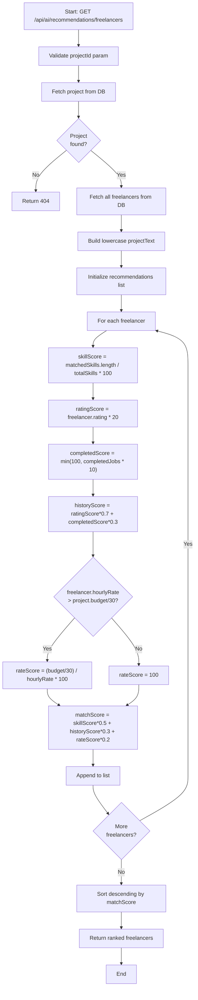

### D. Time and Space Complexity

Let F = number of freelancers, S_max = maximum skills per freelancer, L = average text length.

| Operation | Time Complexity | Space Complexity |
|---|---|---|
| Database fetch all freelancers | O(F) | O(F) |
| Skill scan per freelancer | O(S_max * L) | O(S_max) |
| History + rate score computation | O(1) per freelancer | O(1) |
| Sort | O(F log F) | O(F) |
| **Overall** | **O(F * S_max * L + F log F)** | **O(F)** |

---

## VI. Algorithm 4: AI Dispute Arbitration via Rule-Based NLP

### A. Purpose and Context

Dispute resolution in freelance platforms traditionally requires expensive human arbitrators. Payshield employs a rule-based Natural Language Processing (NLP) classifier that scans the aggregated dispute conversation thread for predefined semantic indicator keywords. Based on detected patterns, the algorithm assigns a percentage split of the locked escrow funds between the client and freelancer, accompanied by a confidence score and rationale. A cascade of mutually exclusive rules is evaluated in priority order, with a default fallback of equal 50/50 split when no clear pattern is detected. This approach ensures explainability, auditability, and instant resolution without requiring an external LLM API.

**Source File:** [`aiController.ts`](file:///Users/akshata/Desktop/Payshield/src/controllers/aiController.ts) — `arbitrateDisputeWithAI()`

### B. Pseudocode

```
ALGORITHM: ArbitrateDisputeWithAI
INPUT:  disputeId (string)
OUTPUT: Updated dispute with aiResolution object

1.  dispute  <- Database.findDispute(disputeId)
2.  IF dispute IS NULL THEN RETURN ERROR 404 END IF
3.  project  <- Database.findProject(dispute.projectId)

4.  // Aggregate all message text
5.  allText  <- LOWERCASE(CONCAT(dispute.messages[].text, separator=" "))

6.  // Default verdict (no clear signal)
7.  splitFreelancer <- 50
8.  splitClient     <- 50
9.  confidence      <- 85
10. suggestion      <- "Equitable split: 50% to client, 50% to freelancer."
11. rationale       <- "Mutual communication breakdown. Partial work completed."

12. // Rule Priority 1: Delivery failure evidence
13. IF "delay" IN allText OR "late" IN allText OR "missing" IN allText THEN
14.     splitFreelancer <- 30
15.     splitClient     <- 70
16.     confidence      <- 90
17.     suggestion      <- "Release 30% to Freelancer, refund 70% to Client."
18.     rationale       <- "Delivery delays and missing requirements detected."
19.     APPEND "Rule Triggered: Deliverable delay identified" TO auditLog

20. // Rule Priority 2: Successful delivery evidence
21. ELSE IF "perfect" IN allText OR "delivered" IN allText
22.         OR "completed" IN allText OR "code is done" IN allText THEN
23.     splitFreelancer <- 80
24.     splitClient     <- 20
25.     confidence      <- 93
26.     suggestion      <- "Release 80% to Freelancer, refund 20% to Client."
27.     rationale       <- "High delivery completeness found in evidence."
28.     APPEND "Rule Triggered: Delivery validation successful" TO auditLog

29. // Rule Priority 3: Freelancer communication blackout
30. ELSE IF "ghost" IN allText OR "ignored" IN allText OR "no reply" IN allText THEN
31.     splitFreelancer <- 10
32.     splitClient     <- 90
33.     confidence      <- 95
34.     suggestion      <- "Release 10% to Freelancer, refund 90% to Client."
35.     rationale       <- "Freelancer communication blackout pattern detected."
36.     APPEND "Rule Triggered: Unresponsive freelancer detected" TO auditLog

37. END IF

38. APPEND "Confidence score: " + confidence + "%" TO auditLog
39. APPEND "Resolution transaction details generated" TO auditLog

40. dispute.aiResolution <- {
41.     suggestion, splitFreelancer, splitClient, confidence, rationale,
42.     resolvedAt: NOW()
43. }
44. dispute.status <- "resolved_by_ai"
45. Database.save(dispute)
46. RETURN dispute
```

### C. Flowchart

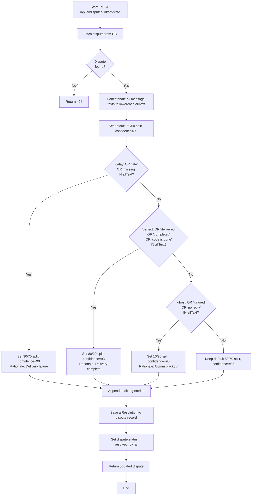

### D. Time and Space Complexity

Let T = total length of all concatenated dispute message text (characters), R = number of rules (constant = 3), K_r = keyword count per rule (constant <= 4).

| Operation | Time Complexity | Space Complexity |
|---|---|---|
| Concatenate messages | O(M * L_msg) where M = message count, L_msg = avg message length | O(T) |
| Keyword substring search per rule | O(K_r * T) per rule; R rules total = O(R * K_r * T) = O(T) since R, K_r are constant | O(1) |
| Database save | O(log n) | O(1) |
| **Overall** | **O(T)** — linear in total conversation size | **O(T)** |

The algorithm runs in linear time with respect to the dispute conversation length. This is optimal since the entire text must be scanned at least once.

---

## VII. Algorithm 5: Cryptographic Signature Verification for Dispute Evidence

### A. Purpose and Context

When a party submits evidence in a dispute thread, it is critical to cryptographically verify that the submission originates from the claimed wallet owner. Payshield applies Ed25519 detached signature verification to each dispute message when a wallet signature is provided. Messages that pass verification are annotated with a "[Wallet Signed]" indicator, while unverified statements are marked as such. This produces an immutable, auditable chain of evidence where the authenticity of each submission is cryptographically proven.

**Source File:** [`aiController.ts`](file:///Users/akshata/Desktop/Payshield/src/controllers/aiController.ts) — `addDisputeMessage()`

### B. Pseudocode

```
ALGORITHM: VerifyDisputeMessageSignature
INPUT:  message (UTF-8 string), signature (Base58 string), publicKey (Base58 string)
OUTPUT: isVerified (boolean), annotated message text

1.  isCryptographicallyVerified <- FALSE
2.  IF signature IS NOT NULL AND publicKey IS NOT NULL THEN
3.      TRY
4.          messageBytes    <- TextEncoder.encode(message)
5.          signatureBytes  <- Base58.decode(signature)    // 64 bytes
6.          publicKeyBytes  <- Base58.decode(publicKey)    // 32 bytes
7.          isCryptographicallyVerified <-
8.              nacl.sign.detached.verify(messageBytes, signatureBytes, publicKeyBytes)
9.      CATCH error
10.         isCryptographicallyVerified <- FALSE
11.     END TRY
12. END IF

13. IF isCryptographicallyVerified THEN
14.     textToSave      <- message + " [Wallet Signed]"
15.     auditIndicator  <- "[CRYPTOGRAPHICALLY VERIFIED]"
16. ELSE
17.     textToSave      <- message
18.     auditIndicator  <- "[UNVERIFIED STATEMENT]"
19. END IF

20. dispute.messages.push({ sender, text: textToSave, timestamp: NOW() })
21. dispute.auditLog.push("Statement by " + sender + ": " + auditIndicator)
22. Database.save(dispute)
23. RETURN isCryptographicallyVerified
```

### C. Flowchart

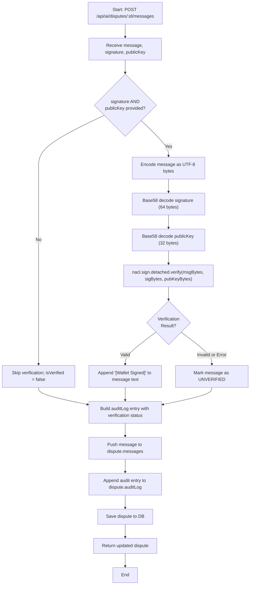

### D. Time and Space Complexity

| Operation | Time Complexity | Space Complexity |
|---|---|---|
| UTF-8 encode message | O(|msg|) — |msg| = message length in characters | O(|msg|) |
| Base58 decode (signature) | O(88) = O(1) — fixed 64-byte signature encodes to ~88 chars | O(1) |
| Base58 decode (publicKey) | O(44) = O(1) — fixed 32-byte key | O(1) |
| Ed25519 verify | O(1) — fixed-length inputs; elliptic curve scalar multiplication is constant | O(1) |
| DB save | O(log n) | O(1) |
| **Overall** | **O(|msg| + log n)** | **O(|msg|)** |

---

## VIII. Algorithm 6: Program-Derived Address (PDA) Escrow Fund Locking

### A. Purpose and Context

The central financial primitive of Payshield is the on-chain escrow mechanism. When a project begins, the client locks the total project budget — denominated in USDC (an SPL token) — into a Program-Derived Address (PDA) vault account. A PDA is a deterministically computable address that can be signed for by the program itself, meaning no private key exists for it. Funds are partitioned into per-milestone amounts. The sum of all milestone amounts must equal the total project budget, enforced as an invariant. The Solana Token Program handles the actual transfer via a Cross-Program Invocation (CPI).

**Source Files:** [`initialize_escrow.rs`](file:///Users/akshata/Desktop/Payshield/solanahub_protocol/programs/solanahub_protocol/src/instructions/initialize_escrow.rs)

### B. Pseudocode

```
ALGORITHM: InitializeEscrow (Rust/Anchor On-Chain)
INPUT:  projectId (u64), milestoneAmounts (Vec<u64>)
OUTPUT: Initialized Escrow PDA account, funds locked in vault

PRE-CONDITIONS:
  - project.status == ProjectStatus::Assigned
  - Caller (client) matches project.client
  - client_ata.mint == accepted USDC mint

1.  project <- PDA["project", projectId.to_le_bytes()]
2.  escrow  <- PDA["escrow",  projectId.to_le_bytes()]  // newly initialized

3.  // Invariant validation
4.  totalMilestoneAmount <- SUM(milestoneAmounts)
5.  ASSERT totalMilestoneAmount == project.total_budget
        ELSE RETURN ErrorCode::InsufficientBalance
6.  ASSERT milestoneAmounts.length == project.milestone_count
        ELSE RETURN ErrorCode::InvalidMilestoneCount

7.  // Initialize escrow account state
8.  escrow.project_id      <- projectId
9.  escrow.project_pda     <- project.key()
10. escrow.client          <- project.client
11. escrow.freelancer      <- project.freelancer
12. escrow.mint            <- mint.key()
13. escrow.vault           <- escrow_vault.key()
14. escrow.total_amount    <- project.total_budget
15. escrow.amount_released <- 0
16. escrow.milestone_amounts <- milestoneAmounts
17. escrow.bump            <- ctx.bumps.escrow

18. // Cross-Program Invocation: Transfer USDC
19. CPI: token::transfer(
20.     FROM: client_ata (client's Associated Token Account),
21.     TO:   escrow_vault (PDA-owned Associated Token Account),
22.     AUTHORITY: client (Signer),
23.     AMOUNT: project.total_budget
24. )

25. // Update project lifecycle state
26. project.status <- ProjectStatus::InProgress

27. EMIT EscrowInitializedEvent { projectId, total_amount, mint }
28. RETURN OK
```

### C. Flowchart

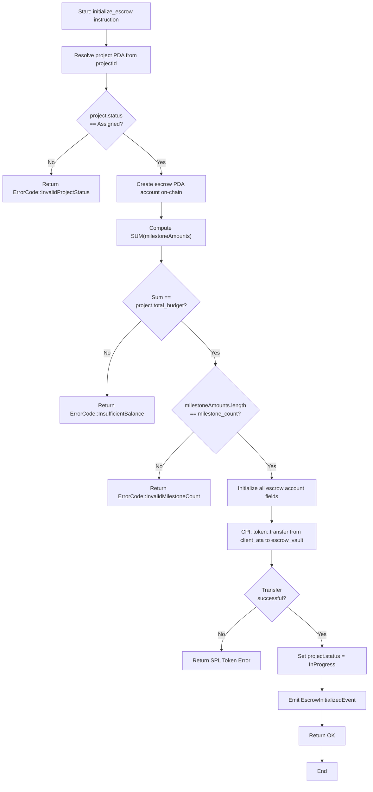

### D. Time and Space Complexity

| Operation | Time Complexity | Space Complexity |
|---|---|---|
| PDA derivation (SHA256-based) | O(1) — fixed seed inputs | O(1) |
| Milestone sum validation | O(m) — m = milestone count (max 10 by constant) = O(1) | O(m) |
| Account initialization | O(1) | O(E) — E = Escrow struct size (fixed) |
| SPL Token transfer (CPI) | O(1) — single token account update | O(1) |
| **Overall** | **O(m) = O(1)** (m bounded by constant MAX=10) | **O(m)** |

The on-chain storage for the Escrow account is fixed: 8 bytes discriminator + 32+32+32+32+8+8+8+10*8+1 = approximately 201 bytes.

---

## IX. Algorithm 7: On-Chain Reputation Scoring with Bitwise Badge System

### A. Purpose and Context

Payshield maintains a tamper-proof, on-chain reputation record for every user. The reputation system uses an incremental average computation that avoids storing the full review history (which would require unbounded storage in a blockchain account). Ratings (1 to 5 stars) are accumulated in two counters: `total_reviews` and `total_score`. The average is recomputed on every review submission. To preserve one decimal place of precision without floating-point arithmetic (unavailable in on-chain programs), scores are scaled by a factor of 10 (e.g., a rating of 4.5 is stored as 45 in a `u8`). Badges are stored as a bitmask in a single byte, with individual badge types mapped to specific bit positions.

**Source Files:** [`submit_review.rs`](file:///Users/akshata/Desktop/Payshield/solanahub_protocol/programs/solanahub_protocol/src/instructions/submit_review.rs), [`reputation.rs`](file:///Users/akshata/Desktop/Payshield/solanahub_protocol/programs/solanahub_protocol/src/state/reputation.rs)

**Badge Bit Definitions:**
- `BADGE_TOP_RATED   = 1 << 0` (bit 0): Average >= 4.5 and reviews > 5
- `BADGE_FAST_DELIVERY = 1 << 1` (bit 1): Reserved for future use
- `BADGE_VETERAN     = 1 << 2` (bit 2): Total reviews > 20

### B. Pseudocode

```
ALGORITHM: SubmitReview (On-Chain)
INPUT:  projectId (u64), rating (u8, range 1-5), commentHash ([u8; 32])
OUTPUT: Updated Reputation PDA account

PRE-CONDITIONS:
  - reviewer in { project.client, project.freelancer }
  - target_user is the counterparty of reviewer in the project
  - 1 <= rating <= 5

1.  project    <- PDA["project", projectId.to_le_bytes()]
2.  reputation <- PDA["reputation", target_user.key()]  // init_if_needed

3.  // Authorization checks
4.  ASSERT reviewer.key() IN { project.client, project.freelancer }
        ELSE RETURN ErrorCode::Unauthorized
5.  IF reviewer == project.client THEN
6.      ASSERT target_user == project.freelancer ELSE RETURN ErrorCode::Unauthorized
7.  ELSE
8.      ASSERT target_user == project.client ELSE RETURN ErrorCode::Unauthorized
9.  END IF
10. ASSERT 1 <= rating <= 5 ELSE RETURN ErrorCode::InvalidRating

11. // First review: initialize PDA metadata
12. IF reputation.total_reviews == 0 THEN
13.     reputation.user       <- target_user.key()
14.     reputation.created_at <- Clock.unix_timestamp
15.     reputation.bump       <- ctx.bumps.reputation
16. END IF

17. // Incremental average update
18. reputation.total_reviews <- reputation.total_reviews + 1
19. reputation.total_score   <- reputation.total_score + CAST(rating, u64)
20. // Scaled average: multiply total_score by 10 before integer division
21. reputation.average_rating <-
22.     CAST((reputation.total_score * 10) / reputation.total_reviews, u8)
23. // Example: 3 reviews of [5, 4, 4] -> total_score=13, avg = (13*10)/3 = 43 -> 4.3

24. // Badge assignment via bitwise OR
25. IF reputation.average_rating >= 45 AND reputation.total_reviews > 5 THEN
26.     reputation.badges <- reputation.badges OR BADGE_TOP_RATED   // set bit 0
27. END IF
28. IF reputation.total_reviews > 20 THEN
29.     reputation.badges <- reputation.badges OR BADGE_VETERAN      // set bit 2
30. END IF

31. RETURN OK
```

### C. Flowchart

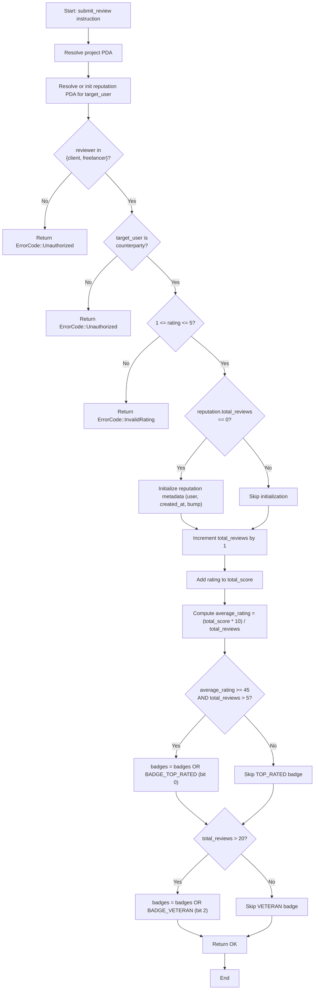

### D. Time and Space Complexity

| Operation | Time Complexity | Space Complexity |
|---|---|---|
| PDA derivation | O(1) | O(1) |
| Authorization checks | O(1) — constant comparisons | O(1) |
| Incremental average update | O(1) — two additions and one integer division | O(1) |
| Badge bitwise operations | O(1) — two conditional bitwise ORs | O(1) |
| **Overall** | **O(1)** | **O(1)** — fixed Reputation struct (no growing arrays) |

The Reputation account has fixed size: 32 (Pubkey) + 8 + 8 + 1 + 1 + 8 + 8 + 1 = 67 bytes. This is critical for on-chain storage predictability and rent-exemption calculation.

---

## X. Algorithm 8: Time-Lock Automatic Escrow Release

### A. Purpose and Context

A persistent problem in freelance platforms is the "client ghost" scenario: a freelancer submits completed work but the client never approves or rejects, effectively holding funds indefinitely. The time-lock auto-release algorithm resolves this by making the payment system self-executing. After a freelancer submits a deliverable (setting `milestone.submitted_at`), any party may invoke `process_auto_release` after seven days have elapsed. The Solana on-chain clock (`Clock::get()?.unix_timestamp`) is used as the authoritative time source. The constant `AUTO_RELEASE_DELAY = 7 * 24 * 60 * 60` (604,800 seconds) is defined in `constants.rs`.

**Source Files:** [`process_auto_release.rs`](file:///Users/akshata/Desktop/Payshield/solanahub_protocol/programs/solanahub_protocol/src/instructions/process_auto_release.rs), [`constants.rs`](file:///Users/akshata/Desktop/Payshield/solanahub_protocol/programs/solanahub_protocol/src/constants.rs)

### B. Pseudocode

```
ALGORITHM: ProcessAutoRelease (On-Chain)
INPUT:  milestoneIndex (u8)
OUTPUT: Milestone status updated to Released, escrow amount_released incremented

PRE-CONDITIONS:
  - milestone.status == MilestoneStatus::Submitted
  - milestone.submitted_at IS NOT NULL

CONSTANTS:
  SEVEN_DAYS <- 7 * 24 * 60 * 60   // 604,800 seconds

1.  project  <- PDA["project",  project.project_id.to_le_bytes()]
2.  escrow   <- PDA["escrow",   project.project_id.to_le_bytes()]
3.  milestone <- PDA["milestone", project.project_id || milestoneIndex]

4.  ASSERT milestone.status == Submitted
        ELSE RETURN ErrorCode::InvalidMilestoneStatus

5.  clock       <- Solana Clock (current unix_timestamp)
6.  submittedAt <- milestone.submitted_at
        ELSE IF NULL RETURN ErrorCode::InvalidMilestoneStatus

7.  // Time-lock check
8.  IF clock.unix_timestamp < submittedAt + SEVEN_DAYS THEN
9.      RETURN ErrorCode::AutoReleaseNotReady
10. END IF

11. // Release funds
12. milestone.status         <- MilestoneStatus::Released
13. escrow.amount_released   <-
14.     escrow.amount_released.checked_add(milestone.amount)

15. EMIT MilestoneReleasedEvent { projectId, milestoneIndex, amount }
16. RETURN OK
```

### C. Flowchart

```mermaid
flowchart TD
    A["Start: process_auto_release instruction"] --> B["Resolve project, escrow, and milestone PDAs"]
    B --> C{"milestone.status\n== Submitted?"}
    C -->|No| D["Return ErrorCode::InvalidMilestoneStatus"]
    C -->|Yes| E["Read Solana on-chain clock: current unix_timestamp"]
    E --> F["Read milestone.submitted_at"]
    F --> G{"submitted_at\nis null?"}
    G -->|Yes| H["Return ErrorCode::InvalidMilestoneStatus"]
    G -->|No| I{"current_time >=\nsubmitted_at + 604800?"]
    I -->|No| J["Return ErrorCode::AutoReleaseNotReady"]
    I -->|Yes| K["Set milestone.status = Released"]
    K --> L["escrow.amount_released += milestone.amount (checked_add)"]
    L --> M["Emit MilestoneReleasedEvent"]
    M --> N["Return OK"]
    N --> O["End"]
```

### D. Time and Space Complexity

| Operation | Time Complexity | Space Complexity |
|---|---|---|
| PDA resolution (3 accounts) | O(1) each — SHA256 with fixed seeds | O(1) |
| Clock read | O(1) — Solana sysvar read | O(1) |
| Arithmetic comparison and addition | O(1) | O(1) |
| State mutation | O(1) | O(1) — modifies existing fixed-size accounts |
| **Overall** | **O(1)** | **O(1)** |

---

## XI. Algorithm 9: Community Dispute Voting (Simple Majority DAO)

### A. Purpose and Context

When AI arbitration alone is insufficient or contested, Payshield provides a decentralized autonomous organization (DAO) fallback in which community members designated as jurors vote on the dispute outcome. The constant `JUROR_COUNT = 5` (defined in `constants.rs`) sets the quorum. The `cast_vote` instruction records individual votes and checks for simple majority (> JUROR_COUNT / 2). The `execute_verdict` instruction finalizes the fund distribution based on the majority outcome.

**Source Files:** [`cast_vote.rs`](file:///Users/akshata/Desktop/Payshield/solanahub_protocol/programs/solanahub_protocol/src/instructions/cast_vote.rs), [`execute_verdict.rs`](file:///Users/akshata/Desktop/Payshield/solanahub_protocol/programs/solanahub_protocol/src/instructions/execute_verdict.rs)

### B. Pseudocode

```
ALGORITHM: CastVote (On-Chain)
INPUT:  dispute (PDA), voter (Signer), vote (Enum: Client | Freelancer)
OUTPUT: Updated dispute vote tallies; status updated if majority reached

PRE-CONDITIONS:
  - dispute.status == DisputeStatus::Voting
  - voter has not previously voted (deduplication via PDA seed including voter key)

CONSTANTS:
  JUROR_COUNT <- 5

1.  ASSERT dispute.status == DisputeStatus::Voting
        ELSE RETURN ErrorCode::InvalidMilestoneStatus

2.  // Record vote
3.  IF vote == Freelancer THEN
4.      dispute.votes_freelancer <- dispute.votes_freelancer + 1
5.  ELSE
6.      dispute.votes_client     <- dispute.votes_client + 1
7.  END IF

8.  // Check for majority
9.  threshold <- JUROR_COUNT / 2   // = 2 (integer division)

10. IF dispute.votes_client > threshold THEN
11.     dispute.status <- DisputeStatus::ResolvedClient
12. ELSE IF dispute.votes_freelancer > threshold THEN
13.     dispute.status <- DisputeStatus::ResolvedFreelancer
14. END IF

15. RETURN OK


ALGORITHM: ExecuteVerdict (On-Chain)
INPUT:  dispute, project, client wallet, freelancer wallet
OUTPUT: Funds transferred according to winning party

1.  ASSERT dispute.status IN { ResolvedClient, ResolvedFreelancer }
2.  IF dispute.status == ResolvedClient THEN
3.      // Transfer 100% of remaining escrow to client
4.      CPI: token::transfer(escrow_vault -> client_ata, remainingAmount)
5.  ELSE
6.      // Transfer 100% of remaining escrow to freelancer
7.      CPI: token::transfer(escrow_vault -> freelancer_ata, remainingAmount)
8.  END IF
9.  RETURN OK
```

### C. Flowchart

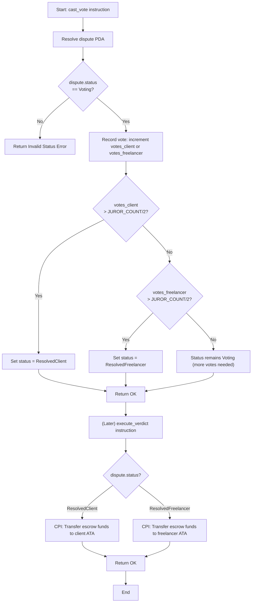

### D. Time and Space Complexity

| Operation | Time Complexity | Space Complexity |
|---|---|---|
| Vote recording | O(1) — increment two counters | O(1) |
| Majority check | O(1) — two comparisons with constant JUROR_COUNT | O(1) |
| Fund transfer (execute_verdict CPI) | O(1) — single token account update | O(1) |
| **Overall (cast_vote)** | **O(1)** | **O(1)** |
| **Overall (execute_verdict)** | **O(1)** | **O(1)** |

---

## XII. Algorithm 10: Token Staking

### A. Purpose and Context

To encourage long-term platform participation and align incentives, Payshield implements a token staking mechanism. Users transfer SPL tokens into a program-controlled staking vault. The `UserStake` PDA records the staked amount and the timestamp of the most recent stake event. Staking serves as a trust signal for reputation (higher stakes imply higher commitment) and as a prerequisite for governance voting eligibility in the DAO voting system.

**Source Files:** [`stake.rs`](file:///Users/akshata/Desktop/Payshield/solanahub_protocol/programs/solanahub_protocol/src/instructions/stake.rs), [`staking.rs`](file:///Users/akshata/Desktop/Payshield/solanahub_protocol/programs/solanahub_protocol/src/state/staking.rs)

### B. Pseudocode

```
ALGORITHM: Stake (On-Chain)
INPUT:  amount (u64, in lamports/token base units)
OUTPUT: UserStake PDA updated, tokens transferred to staking vault

1.  user       <- Signer (user wallet)
2.  user_stake <- PDA["stake", user.key()]   // init_if_needed
3.  clock      <- Solana Clock

4.  // Cross-Program Invocation: Transfer tokens to staking vault
5.  CPI: token::transfer(
6.      FROM:      user_token_account,
7.      TO:        staking_vault (PDA["staking_vault"]),
8.      AUTHORITY: user (Signer),
9.      AMOUNT:    amount
10. )

11. // Initialize user stake record on first stake
12. IF user_stake.amount == 0 THEN
13.     user_stake.user <- user.key()
14.     user_stake.bump <- ctx.bumps.user_stake
15. END IF

16. // Accumulate stake (overflow-safe)
17. user_stake.amount <- user_stake.amount.checked_add(amount)
18. user_stake.since  <- clock.unix_timestamp   // record latest stake time

19. RETURN OK
```

### C. Flowchart

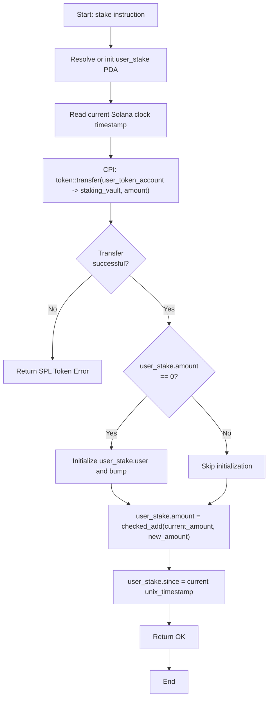

### D. Time and Space Complexity

| Operation | Time Complexity | Space Complexity |
|---|---|---|
| PDA derivation | O(1) | O(1) |
| SPL Token CPI transfer | O(1) | O(1) |
| Conditional initialization | O(1) | O(1) |
| Checked integer addition | O(1) | O(1) |
| **Overall** | **O(1)** | **O(1)** — UserStake struct is fixed size |

---

## XIII. Algorithm 11: Client-Side Skill Match Score

### A. Purpose and Context

The frontend computes a lightweight skill match percentage for real-time UI rendering before API results are received. This provides instant visual feedback in the job browsing experience. The algorithm performs a set intersection between two normalized skill arrays (job required skills and freelancer skills), computing the ratio of matched to total job requirements.

**Source File:** [`helpers.js`](file:///Users/akshata/Desktop/Payshield/client_vite/src/utils/helpers.js) — `getMatchScore()`

### B. Pseudocode

```
ALGORITHM: GetMatchScore
INPUT:  jobSkills (string[]), freelancerSkills (string[])
OUTPUT: matchPercentage (integer in range [0, 100])

1.  // Normalize both arrays: lowercase and trim whitespace
2.  normalize <- (arr) -> arr.map(s -> LOWERCASE(TRIM(s)))
3.  jSkills   <- normalize(jobSkills)
4.  fSkills   <- normalize(freelancerSkills)

5.  // Set intersection: find skills present in both
6.  matches   <- jSkills FILTER (skill -> skill IN fSkills)

7.  // Compute percentage of job requirements met
8.  IF jSkills.length > 0 THEN
9.      RETURN ROUND((matches.length / jSkills.length) * 100)
10. ELSE
11.     RETURN 0
12. END IF
```

### C. Flowchart

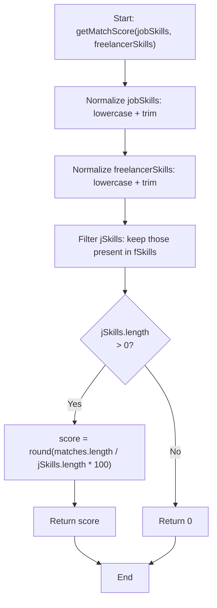

### D. Time and Space Complexity

Let J = number of job skills, F = number of freelancer skills, L = average skill string length.

| Operation | Time Complexity | Space Complexity |
|---|---|---|
| Normalize job skills | O(J * L) | O(J) |
| Normalize freelancer skills | O(F * L) | O(F) |
| Filter/intersection (naive) | O(J * F) — for each job skill, scan freelancer list | O(J) |
| **Overall** | **O(J * F * L)** | **O(J + F)** |

> Note: The naive O(J * F) intersection can be improved to O(J + F) by converting freelancer skills to a hash set first. For typical values (J, F < 20, L < 30), both approaches execute in sub-millisecond time in the browser.

---

## XIV. Algorithm 12: Relative Time Calculation

### A. Purpose and Context

Activity feeds, dispute threads, and project deadlines require human-readable temporal representation. The `timeAgo()` function converts an absolute timestamp to a relative string (e.g., "47m ago", "3h ago", "12d ago"). The `daysLeft()` function converts a deadline timestamp to a countdown or overdue indicator.

**Source File:** [`helpers.js`](file:///Users/akshata/Desktop/Payshield/client_vite/src/utils/helpers.js) — `timeAgo()`, `daysLeft()`

### B. Pseudocode

```
ALGORITHM: TimeAgo
INPUT:  dateStr (ISO date string or timestamp)
OUTPUT: Human-readable relative time string

1.  diff <- Date.now() - new Date(dateStr).getTime()   // milliseconds
2.  mins <- FLOOR(diff / 60000)
3.  IF mins < 60 THEN
4.      RETURN TOSTRING(mins) + "m ago"
5.  END IF
6.  hrs  <- FLOOR(mins / 60)
7.  IF hrs < 24 THEN
8.      RETURN TOSTRING(hrs) + "h ago"
9.  END IF
10. days <- FLOOR(hrs / 24)
11. RETURN TOSTRING(days) + "d ago"


ALGORITHM: DaysLeft
INPUT:  deadline (ISO date string or timestamp)
OUTPUT: Countdown string or status indicator

1.  diff <- new Date(deadline).getTime() - Date.now()
2.  days <- CEIL(diff / 86400000)     // 86400000 ms per day
3.  IF days < 0  THEN RETURN "Overdue" END IF
4.  IF days == 0 THEN RETURN "Due today" END IF
5.  RETURN TOSTRING(days) + "d left"
```

### C. Flowchart

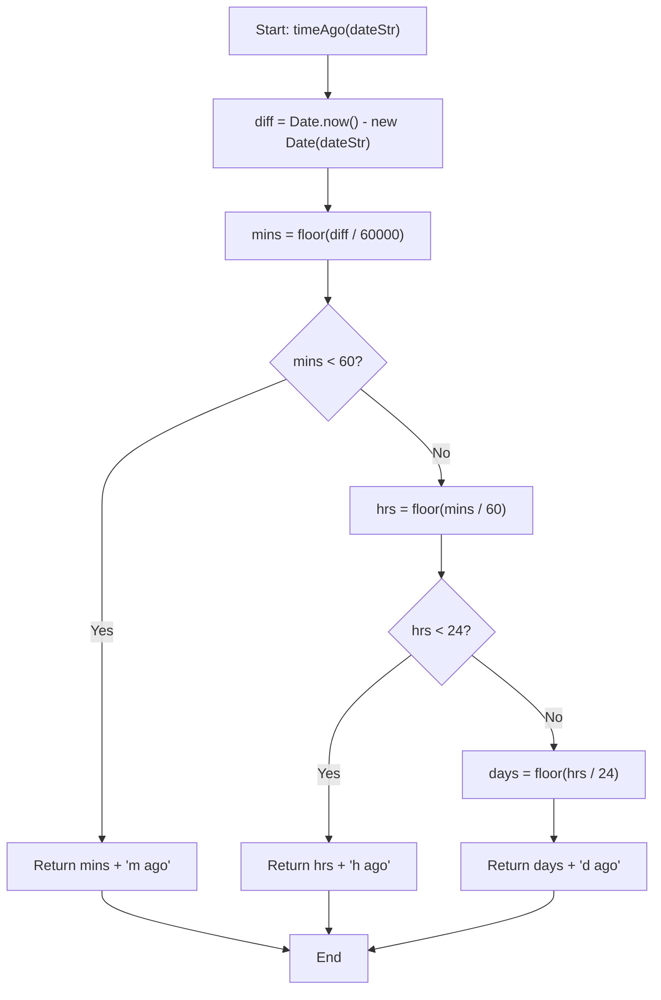

### D. Time and Space Complexity

| Operation | Time Complexity | Space Complexity |
|---|---|---|
| Date parsing and arithmetic | O(1) — constant number of divisions | O(1) |
| String construction | O(1) — output string length is bounded | O(1) |
| **Overall (both functions)** | **O(1)** | **O(1)** |

---

## XV. Algorithm 13: Content Hash Anchoring (SHA-256 Integrity Protocol)

### A. Purpose and Context

Solana accounts have fixed, pre-allocated storage. Storing arbitrary text (project descriptions, deliverable files, message bodies, review comments) directly on-chain is cost-prohibitive. Payshield employs a content-addressed storage pattern: the full content is stored off-chain (MongoDB for structured data, IPFS for binary files), and only the 32-byte SHA-256 digest is stored on-chain. This creates an immutable cryptographic commitment — any modification to the off-chain content will produce a different hash, which can be detected by comparison with the on-chain anchor. All on-chain instructions that reference content use `[u8; 32]` (32-byte array) parameters named with the `_hash` suffix.

**Source Files:** [`create_project.rs`](file:///Users/akshata/Desktop/Payshield/solanahub_protocol/programs/solanahub_protocol/src/instructions/create_project.rs), [`raise_dispute.rs`](file:///Users/akshata/Desktop/Payshield/solanahub_protocol/programs/solanahub_protocol/src/instructions/raise_dispute.rs), [`submit_deliverable.rs`](file:///Users/akshata/Desktop/Payshield/solanahub_protocol/programs/solanahub_protocol/src/instructions/submit_deliverable.rs), [`send_message.rs`](file:///Users/akshata/Desktop/Payshield/solanahub_protocol/programs/solanahub_protocol/src/instructions/send_message.rs)

### B. Pseudocode

```
ALGORITHM: HashAnchor (Client-Side — Off-Chain Submission)
INPUT:  contentString (arbitrary UTF-8 text or IPFS CID)
OUTPUT: contentHash ([u8; 32]), stored on-chain

// Client-side hash computation (TypeScript)
1.  contentBytes <- TextEncoder.encode(contentString)
2.  hashBuffer   <- await crypto.subtle.digest("SHA-256", contentBytes)
3.  contentHash  <- new Uint8Array(hashBuffer)   // 32 bytes

// Instruction call (e.g., create_project, submit_deliverable)
4.  CALL on_chain_instruction(contentHash, ...otherParams)

// On-chain storage (Rust/Anchor)
5.  account.description_hash <- contentHash    // stored as [u8; 32]


ALGORITHM: VerifyContentIntegrity (Client-Side — Off-Chain Verification)
INPUT:  offChainContent (string), onChainHash ([u8; 32])
OUTPUT: isIntact (boolean)

1.  computedHash <- SHA256(TextEncoder.encode(offChainContent))
2.  isIntact     <- (computedHash == onChainHash)   // byte-wise comparison
3.  RETURN isIntact
```

### C. Flowchart

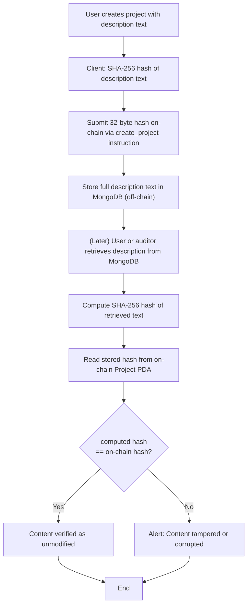

### D. Time and Space Complexity

| Operation | Time Complexity | Space Complexity |
|---|---|---|
| SHA-256 computation | O(|content|) — linear in content length | O(1) — 32-byte output |
| On-chain storage of hash | O(1) — 32 bytes, fixed | O(1) |
| Integrity verification (comparison) | O(1) — byte-wise comparison of two 32-byte arrays | O(1) |
| **Overall anchoring** | **O(|content|)** | **O(1)** on-chain, **O(|content|)** off-chain |

---

## XVI. Consolidated Complexity Summary

| Algorithm | Description | Time Complexity | Space Complexity | Layer |
|---|---|---|---|---|
| 1 | Wallet Nonce Authentication | O(log n) | O(k) | Backend |
| 2 | AI Job Recommendation Engine | O(P * S * L + P log P) | O(P + S) | Backend |
| 3 | AI Freelancer Recommendation Engine | O(F * S * L + F log F) | O(F) | Backend |
| 4 | AI Dispute Arbitration (NLP) | O(T) | O(T) | Backend |
| 5 | Ed25519 Signature Verification | O(|msg| + log n) | O(|msg|) | Backend |
| 6 | PDA Escrow Fund Locking | O(m) = O(1) | O(m) | Smart Contract |
| 7 | On-Chain Reputation Scoring | O(1) | O(1) | Smart Contract |
| 8 | Time-Lock Auto-Release | O(1) | O(1) | Smart Contract |
| 9 | Community DAO Voting | O(1) | O(1) | Smart Contract |
| 10 | Token Staking | O(1) | O(1) | Smart Contract |
| 11 | Client-Side Skill Match Score | O(J * F * L) | O(J + F) | Frontend |
| 12 | Relative Time Calculation | O(1) | O(1) | Frontend |
| 13 | Content Hash Anchoring (SHA-256) | O(|content|) | O(1) on-chain | Cross-Layer |

**Notation:** n = users, P = open projects, F = freelancers, S = skills count, L = avg text length, T = total dispute text, m = milestone count (max 10), J = job skill count, k = Base58 key length (44 chars), |msg| = message length.

---

## XVII. Discussion

**Cryptographic Soundness.** Algorithms 1, 5, and 13 form a coherent cryptographic trust chain. Authentication is underpinned by Ed25519 signatures (256-bit security level), dispute evidence is signed with the same mechanism, and content integrity is guaranteed by SHA-256 (collision resistance: 128-bit). The nonce rotation in Algorithm 1 eliminates replay attacks at zero additional computational cost.

**AI System Design Rationale.** Algorithms 2, 3, and 4 deliberately avoid external Large Language Model dependencies. While LLM-based approaches could offer richer semantic understanding, they introduce network latency, API cost, availability risk, and non-determinism — all undesirable in a financial dispute context. The weighted scoring approach (Algorithms 2, 3) is fully explainable, deterministic, and debuggable. The rule-based NLP classifier (Algorithm 4) produces an auditable decision trail compatible with blockchain transparency requirements.

**On-Chain Efficiency.** All seven smart contract algorithms (6 through 10, plus hash anchoring) operate in O(1) time and O(1) space with respect to external data. This is a necessary design constraint of the Solana compute unit budget and fixed-size account model. The incremental average in Algorithm 7 and bitmask badges are canonical examples of on-chain storage optimization.

**Scalability Analysis.** The most computationally intensive algorithms are 2 and 3 (O(P * S) and O(F * S) respectively). For a platform with 100,000 open projects and 50 skills per freelancer, this represents 5 million substring comparisons per recommendation request. Practical deployment would require pagination, pre-indexed skill vectors, or caching — areas identified for future work.

---

## XVIII. Conclusion

This paper presented a comprehensive algorithmic analysis of Payshield, a Solana-based decentralized freelance marketplace. Thirteen distinct algorithms spanning cryptographic authentication, artificial intelligence recommendation, NLP-based dispute arbitration, and smart contract financial primitives were formally described with pseudocode, flowcharts, and Big-O complexity analysis.

The system demonstrates that a production-grade decentralized marketplace can be constructed without reliance on external machine learning APIs or centralized arbitrators, while maintaining computational efficiency appropriate for both Solana's on-chain compute budget and standard web server throughput expectations.

Future directions include: (i) replacing keyword-based NLP with on-device transformer inference for dispute analysis, (ii) implementing time-weighted average pricing for the staking reward computation in Algorithm 10, (iii) upgrading the skill match algorithms to use TF-IDF vector similarity for improved semantic matching, and (iv) implementing zero-knowledge proofs for private reputation attestation.

---

## References

[1] Solana Labs, "Solana Architecture Overview," Solana Documentation, 2024. [Online]. Available: https://docs.solana.com

[2] Coral, "Anchor Framework for Solana Programs," GitHub Repository, 2024. [Online]. Available: https://github.com/coral-xyz/anchor

[3] D. J. Bernstein, "Curve25519: New Diffie-Hellman Speed Records," in *Public Key Cryptography — PKC 2006*, Lecture Notes in Computer Science, vol. 3958, Springer, Berlin, Heidelberg, 2006.

[4] S. Nakamoto, "Bitcoin: A Peer-to-Peer Electronic Cash System," Bitcoin.org, 2008.

[5] NIST, "FIPS PUB 180-4: Secure Hash Standard (SHS)," National Institute of Standards and Technology, 2015.

[6] A. Back et al., "Hashcash — A Denial of Service Counter-Measure," 2002.

[7] SPL Token Program, "Solana Program Library Token Documentation," Solana Labs, 2024. [Online]. Available: https://spl.solana.com/token

[8] M. Wohrer and U. Zdun, "Smart Contracts: Security Patterns in the Ethereum Ecosystem and Solidity," in *Proc. IEEE International Workshop on Blockchain Oriented Software Engineering (IWBOSE)*, 2018, pp. 2–8.

[9] G. Wood, "Ethereum: A Secure Decentralised Generalised Transaction Ledger," Ethereum Project Yellow Paper, 2014.

[10] R. Rivest, A. Shamir, and L. Adleman, "A Method for Obtaining Digital Signatures and Public-Key Cryptosystems," *Communications of the ACM*, vol. 21, no. 2, pp. 120–126, Feb. 1978.

---

*Manuscript received July 2026. This paper describes the Payshield system as implemented in the solanahub_protocol Anchor program (Program ID: 43QYPVLRMQ9skLbbbZ3uGPsLtTbxcmuU4S5hoZ8bXJKS) and accompanying Node.js backend.*
