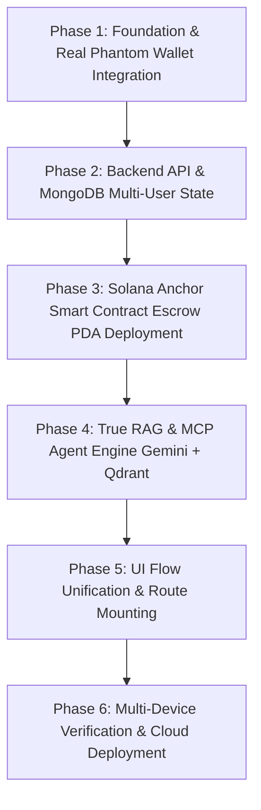

# PayShield: Production-Grade Master Implementation Plan

This actionable master plan outlines the exact tools, APIs, AI/ML models, algorithms, database architectures, and step-by-step priority roadmap to transform PayShield into a fully functioning, secure, and production-ready decentralized platform capable of running a live dual-system Phantom wallet demo on Solana Devnet and deploying smoothly to Vercel/Render.

---

## 1. Complete Resource & Technology Stack

| Layer | Technology / Resource | Specific Version / Endpoint | Purpose |
|---|---|---|---|
| **Blockchain** | Solana Devnet | RPC: `https://api.devnet.solana.com` or Helius / QuickNode | Decentralized Escrow PDA, Milestone Releases, Dispute Settlement |
| **Smart Contract** | Anchor Framework | `v0.30.1` / Rust 1.79+ | Program Derived Address (PDA) multi-sig vaults, on-chain state |
| **Frontend Wallet** | Solana Wallet Adapter | `@solana/wallet-adapter-react`, `@solana/wallet-adapter-wallets` | Real Phantom & Solflare browser wallet integration |
| **Primary Database** | MongoDB Atlas | Mongoose `v8.x` / Replica Set | User profiles, projects, proposals, chat logs, dispute cases |
| **Vector Database** | Qdrant Cloud / Qdrant Docker | `v1.9+` (or Pinecone Serverless) | RAG embeddings for legal terms & historical dispute precedents |
| **LLM Reasoning** | Google Gemini 2.5 Flash / 2.0 Flash | `@google/genai` | Autonomous Copilot, Clause Audit, Dispute Arbitration, Proof-of-Work Review |
| **Embedding Model** | `text-embedding-004` or `bge-small-en-v1.5` | 768-dim / 384-dim | Dense semantic vectorization for RAG retrieval |
| **Predictive ML** | Random Forest Regressor | Python `scikit-learn` / ONNX runtime | Numerical Trust & Fraud Risk scoring |
| **Decentralized Storage** | Pinata / Web3.Storage | IPFS Gateway | Storage of deliverable files, PDFs, test outputs, and evidence |
| **Hosting** | Vercel (Frontend) + Render / Railway (Backend) | HTTPS / WebSockets | Production multi-device deployment |

---

## 2. Mathematical Algorithms & Cryptographic Primitives

```
┌────────────────────────────────────────────────────────────────────────────────────────┐
│                               PAYSHIELD ALGORITHM SUITE                                │
├────────────────────────────┬─────────────────────────────┬─────────────────────────────┤
│ 1. Cryptographic Security  │ 2. Semantic Search & RAG    │ 3. ML Risk & Reputation     │
├────────────────────────────┼─────────────────────────────┼─────────────────────────────┤
│ • Ed25519 Detached Signatures│ • Dense Cosine Similarity:  │ • Incremental Running Avg:  │
│   (tweetnacl / bs58)       │   cos(θ) = (A · B)/(||A||||B||)│   R_new = (R_old*N + r)/(N+1) │
│ • SHA-256 Content Anchoring│ • Reciprocal Rank Fusion    │ • Random Forest Regressor:  │
│ • Solana PDA Derivation    │ • System Boundary Prompt    │   Gini Impurity / MSE split │
│   seeds=[b"escrow", projId]│   Isolation (XML Tagging)   │ • Bitmask Badge Allocation  │
└────────────────────────────┴─────────────────────────────┴─────────────────────────────┘
```

1. **Cryptographic Authentication (Sign-In with Solana - SIWS)**:
   - Challenge: Nonce + timestamp generated by server.
   - Verification: `nacl.sign.detached.verify(messageBytes, signatureBytes, publicKeyBytes)`.
2. **AI Oracle Signature**:
   - Every AI arbitration verdict and contract audit is signed with the backend AI Oracle private key (`Ed25519`) so clients can verify on-chain that the platform admin did not alter the verdict.
3. **Incremental On-Chain Reputation (O(1) Gas)**:
   $$\text{average\_rating} = \frac{\text{total\_score} \times 10}{\text{total\_reviews}}$$
   Stored scaled by 10 as an integer in a single byte (`u8`), with badges encoded in a bitfield byte (`1 << 0` for Top Rated, `1 << 1` for Verified Developer).

---

## 3. Database Schemas

### MongoDB Models (Relational State)
* **`User`**: `publicKey (string, unique)`, `role ("client" | "freelancer")`, `skills (string[])`, `hourlyRate (number)`, `reputationScore (number)`, `nonce (string)`.
* **`Project`**: `projectId (string, unique)`, `clientPubkey (string)`, `freelancerPubkey (string)`, `escrowPda (string)`, `budget (number)`, `deadline (Date)`, `milestones (Array<{ index, title, amount, status: "pending" | "funded" | "submitted" | "approved" | "disputed", ipfsHash, githubRepo }>)`, `status ("draft" | "open" | "in_progress" | "completed" | "disputed")`.
* **`Dispute`**: `disputeId (string, unique)`, `projectId (string)`, `milestoneIndex (number)`, `raisedBy (string)`, `evidenceFiles (string[])`, `aiResolution ({ suggestedSplit: { client, freelancer }, rationale, aiSignature, confidenceScore })`, `status ("under_review" | "resolved_by_ai" | "manual_override")`.

### Qdrant Vector Collections (Semantic Knowledge)
* **`platform_legal_rules`**: Vectors (768-dim), Payload: `{ ruleId, title, category, fullText, penaltyThreshold }`.
* **`arbitration_precedents`**: Vectors (768-dim), Payload: `{ precedentId, category, summary, evidenceMetrics, splitRatio, rationale }`.

---

## 4. Priority-Ordered Implementation Roadmap



---

### 🔴 Phase 1: Real Phantom Wallet & Solana Integration (Foundation)
*Goal: Enable real wallet connection on both Client and Freelancer devices without hardcoded addresses or MetaMask fallbacks.*

1. **Install Dependencies in `frontend/package.json`**:
   ```bash
   npm install @solana/web3.js @coral-xyz/anchor @solana/wallet-adapter-base @solana/wallet-adapter-react @solana/wallet-adapter-react-ui @solana/wallet-adapter-wallets bs58
   ```
2. **Rewrite `frontend/src/context/WalletContext.jsx`**:
   - Wrap the application in `ConnectionProvider` (pointing to Solana Devnet) and `WalletProvider` with `PhantomWalletAdapter` and `SolflareWalletAdapter`.
   - Provide standard wallet state (`publicKey`, `signTransaction`, `sendTransaction`, `connected`).
3. **Implement Sign-In with Solana (SIWS) in `frontend/src/context/AuthContext.jsx`**:
   - Step 1: Request a cryptographic challenge nonce from `POST /api/auth/nonce`.
   - Step 2: Prompt Phantom wallet to sign the message: `"Sign in to PayShield: Nonce ${nonce}"`.
   - Step 3: Send public key and signature to `POST /api/auth/wallet` to receive a JWT session token.
   - Store JWT in `localStorage` so sessions persist reliably across page refreshes.

---

### 🔴 Phase 2: Backend Core & Multi-User State Synchronization
*Goal: Ensure actions taken on Machine 1 (Client) instantly reflect on Machine 2 (Freelancer).*

1. **Fix `aiRoutes.ts` and API Security**:
   - Clean up route duplicates and ensure all state-mutating and AI routes are protected with `protect` middleware and rate limiters.
2. **Implement Real Project & Milestone Controllers**:
   - `POST /api/projects`: Client creates job; saves to MongoDB; assigns unique `projectId`.
   - `GET /api/projects/open`: Freelancer queries available jobs dynamically.
   - `POST /api/projects/:id/apply`: Freelancer submits proposal with bid and timeline.
   - `POST /api/projects/:id/hire`: Client accepts proposal; locks freelancer public key to project.
   - `POST /api/submissions`: Freelancer uploads IPFS CID / GitHub repo for milestone review.
   - `POST /api/payments/approve`: Client approves milestone; records on-chain transaction signature.

---

### 🟠 Phase 3: Solana Anchor Program Deployment & Client Invocation
*Goal: Lock and release real Devnet SOL/USDC using Program Derived Addresses (PDAs).*

1. **Deploy Solana Smart Contract to Devnet**:
   - Run `anchor build` and `anchor deploy --provider.cluster devnet` inside `contracts/`.
   - Ensure the generated Program ID matches identically in:
     - `contracts/Anchor.toml`
     - `frontend/src/anchor/useSolanaHubProgram.ts`
     - `backend/src/config/solana.ts`
2. **Connect `CreateContract.jsx` to Anchor PDA Deposit**:
   - Derive PDA: `PublicKey.findProgramAddressSync([Buffer.from("escrow"), Buffer.from(projectId)], PROGRAM_ID)`.
   - Call Anchor instruction: `program.methods.initializeEscrow(projectId, milestoneAmounts).accounts({...}).rpc()`.
3. **Connect `PaymentApproval.jsx` to Anchor Milestone Release**:
   - Call Anchor instruction: `program.methods.releaseMilestone(projectId, milestoneIndex).accounts({...}).rpc()`.

---

### 🟠 Phase 4: Production RAG, Native MCP & AI Arbitrator
*Goal: Replace regexes and static keyword heuristics with genuine vector search and Gemini tool calling.*

1. **Deploy Qdrant Vector Search Engine**:
   - Initialize collections `platform_rules` and `dispute_precedents` with 768-dimensional vectors.
   - Vectorize platform terms and historical cases using Gemini `text-embedding-004`.
2. **Refactor `ragService.ts` to Vector Similarity**:
   - Search Qdrant via cosine distance query and retrieve Top-3 semantic matches with confidence thresholds.
   - Guard against prompt injection using structured XML boundaries:
     ```markdown
     <system_precedents>${retrievedDocs}</system_precedents>
     <user_dispute_evidence>${sanitizedInput}</user_dispute_evidence>
     ```
3. **Refactor `agentService.ts` to Native Tool-Calling (MCP)**:
   - Provide Gemini with JSON tool definitions: `get_solana_tx`, `get_solana_balance`, `audit_github_pow`, and `search_rules`.
   - Gemini autonomously decides which tool to call based on conversation context; backend executes the tool and passes structured output back to Gemini.
4. **Harden `githubTools.ts`**:
   - Validate repository authorship (verify commit author email against user profile).
   - Fetch PR diffs and lines changed instead of counting raw commit string keywords.
5. **Add AI Oracle Ed25519 Signatures**:
   - Sign arbitration split JSON using `nacl.sign.detached(verdictBytes, AI_ORACLE_SECRET_KEY)` and return signature for on-chain auditability.

---

### 🟡 Phase 5: Frontend Route Mounting & Component Cleanup
*Goal: Mount all orphaned views and remove mock delays.*

1. **Register All Routes in `frontend/src/App.jsx`**:
   - Add routes for `ClientArbitrator.jsx`, `FreelancerArbitrator.jsx`, `ArbitrationResult.jsx`, `NegotiationHub.jsx`, and `ChatPage.jsx`.
2. **Replace All `localhost:5001` and `localhost:3001` Calls**:
   - Update all `fetch()` calls in components to use `import.meta.env.VITE_API_BASE_URL`.
3. **Remove All Fake `setTimeout` Stubs**:
   - Wire `CreateContract.jsx`, `PaymentApproval.jsx`, `SubmitWork.jsx`, `PostJob.jsx`, and `ApplyJob.jsx` directly to `services/api.js`.

---

### 🟢 Phase 6: Cloud Deployment & Dual-System Live Verification
*Goal: Deploy to public infrastructure and execute a complete end-to-end multi-device live test.*

1. **Deploy Backend**:
   - Deploy `backend/` to Render/Railway as a Node service. Set env vars (`MONGODB_URI`, `GEMINI_API_KEY`, `SOLANA_RPC_URL`, `SOLANA_PROGRAM_ID`, `JWT_SECRET`, `GITHUB_TOKEN`).
2. **Deploy Frontend**:
   - Deploy `frontend/` to Vercel. Set build command `npm run build` and env var `VITE_API_BASE_URL=https://your-backend.onrender.com/api`.
3. **Perform Live Dual-Machine Verification**:
   - **Machine 1 (Client)**: Connect Phantom Wallet -> Post Job -> Accept Proposal -> Deposit Devnet SOL to Escrow PDA.
   - **Machine 2 (Freelancer)**: Connect Phantom Wallet -> Apply to Job -> Submit GitHub Repo for Milestone 1.
   - **Copilot Check**: Ask AI Copilot on either machine to audit the GitHub repo and check escrow balance on Solana ledger.
   - **Machine 1 (Client)**: Approve Milestone 1 -> Phantom signs release transaction -> Funds transfer on-chain -> Status updates in real time on Machine 2.

---

## 5. Verification Checklist

| Milestone | Expected Result | Verification Command / Method |
|---|---|---|
| **Phantom Wallet Connection** | Phantom pops up, signs nonce, returns JWT | Click "Connect Wallet" on both machines |
| **Escrow Deposit on Devnet** | SOL leaves client wallet, enters program PDA | Solana Explorer Devnet inspection |
| **Real-Time Project Sync** | Machine 2 sees job posted by Machine 1 | Refresh / WebSocket sync on Machine 2 |
| **MCP Tool Execution** | Copilot returns live slot number & tx confirmations | Ask Copilot: *"Check tx signature \<sig\>"* |
| **RAG Dispute Resolution** | Model cites relevant precedent ID and signs verdict | Run `/api/ai/disputes/arbitrate-precedents` |
| **Milestone Release** | SOL transfers from Escrow PDA to Freelancer wallet | Approve milestone in UI; verify balance |
